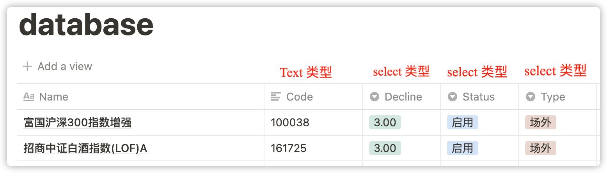
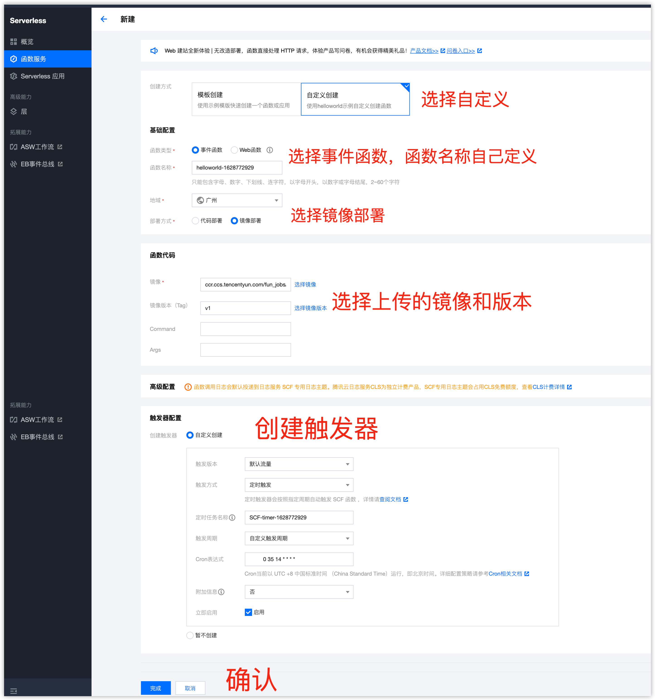
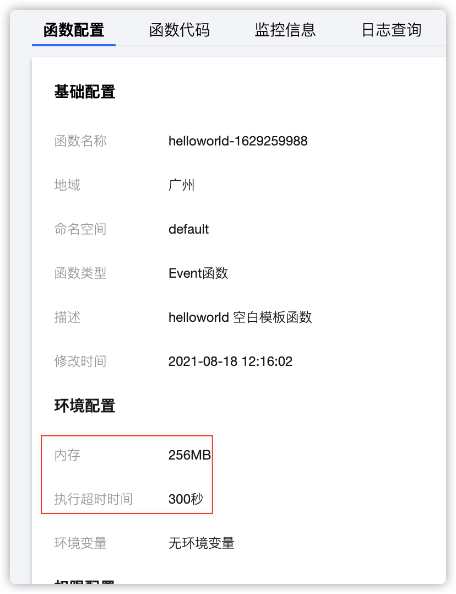
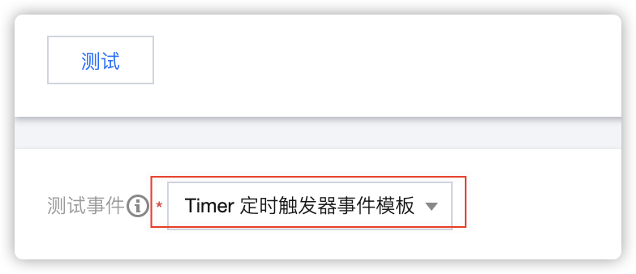

# fund_pegging

基金盯盘


## 食用

### 1. 配置
配置都写在了 conf_back.json 中, 在里边修改配置，然后文件名改为 conf.json 。
其中发送方式写了四种(1 钉钉 2 飞书 3 企业微信(openapi) 4 企业微信(腾讯云函数))，
自己使用任选其一就好。

配置详解
```json
{
  "ding_webhook": "钉钉webhook(这里用的是关键字加密，关键字：基金盯盘)", 
  "lark_webhook": "飞书webhook",
  "wecom_cid": "企业微信中的企业id",
  "wecom_aid": "企业微信中的应用ID",
  "wecom_secret": "企业微信中的应用Secret",
  "wecom_sendkey": "你自己在腾讯云函数中创建秘钥",
  "wecom_network_url": "腾讯云函数中的触发器请求地址",
  "authorization": "Notion 秘钥",
  "databases_id": "Notion 数据库ID",
  "send_type": "默认的消息发送方式"
}
```

可参考下边的文档：  
[获取钉钉webhook文档](https://help.aliyun.com/document_detail/121918.html?utm_content=g_1000230851&spm=5176.20966629.toubu.3.f2991ddcpxxvD1#title-nw5-v22-9in)  
[获取飞书webhook文档](https://open.feishu.cn/document/ukTMukTMukTM/ucTM5YjL3ETO24yNxkjN)  
[企业微信的设置](https://github.com/easychen/wecomchan)  
[腾讯云函数搭建](https://github.com/easychen/wecomchan/tree/main/go-scf)  
[Notion database_id的获取 & 机器人的创建](https://sspai.com/post/66658)


### 2. Notion 数据库
数据库创建格式如下([我的数据库地址](https://joys.notion.site/a1498df489724b638c713618806380cf?v=08899d34db7347a38cc1d6d4edea1b76))


### 3. 本地启动
本地启动命令(依赖自行安装)
```bash
uvicorn app:app --host 0.0.0.0 --port 9000
```

镜像启动
```bash
docker build -t fund_pegging .  # 制作镜像
docker run -p 9000:9000 fund_pegging
```

curl调用  
data-raw 数据模拟的是腾讯云函数定时任务的参数
```bash
curl --location --request POST 'http://127.0.0.1:9000/event-invoke' \
--header 'Content-Type: application/json' \
--data-raw '{
    "Type":"Timer",
    "TriggerName":"EveryDay",
    "Time":"2019-02-21T11:49:00Z",
    "Message":"user define msg body"
}'
```

### 4. 准备镜像
a. [开通个人镜像仓库](https://cloud.tencent.com/document/product/1141/50332)  
b. 提交镜像到腾讯云个人镜像仓库
```bash
docker build -t fund_pegging .  # 进到项目目录中
sudo docker login --username=[username] ccr.ccs.tencentyun.com  # 登录到腾讯云 registry
# 上传镜像
docker tag fund_pegging ccr.ccs.tencentyun.com/你的命名空间/fund_pegging:v1
docker push ccr.ccs.tencentyun.com/你的命名空间/fund_pegging:v1
```

### 5. 使用腾讯云函数部署


函数配置  


测试  
